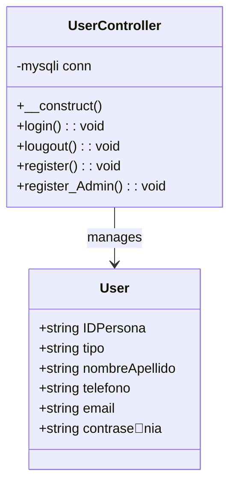
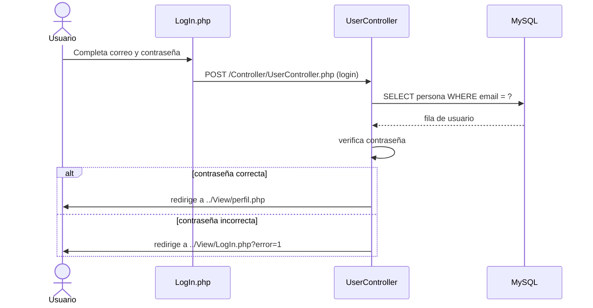
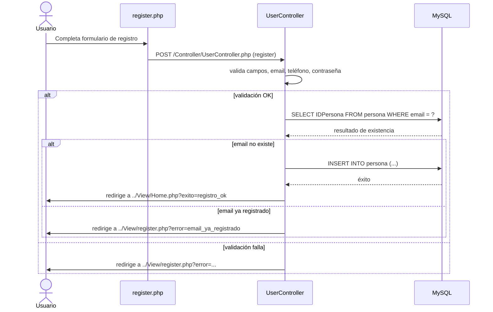

# Stand App

## Overview

Stand App is a PHP web application for user authentication and registration. It includes:

- `LogIn.php` for user login.
- `register.php` for standard user registration.
- `register_Admin.php` for admin/organizer registration.
- `Controller/UserController.php` for authentication and registration logic.
- A MySQL table `persona` used to store user data.

## Project Structure

- `Controller/`
  - `UserController.php`: handles login, logout, register, and register admin requests.
- `View/`
  - `LogIn.php`: login page and form.
  - `register.php`: standard user registration page.
  - `register_Admin.php`: organizer/admin registration page.
  - `perfil.php`: user profile page after login.
  - `Home.php`: landing page after successful registration.
- `Model/`
  - `MF_StandApp.sql`: database schema and seed data.

## User Class Diagram

### Notes

- The database entity in the application is stored in the `persona` table.
- `tipo` distinguishes standard users from admin/organizer users.

## Login Sequence Diagram

## Register Sequence Diagram

