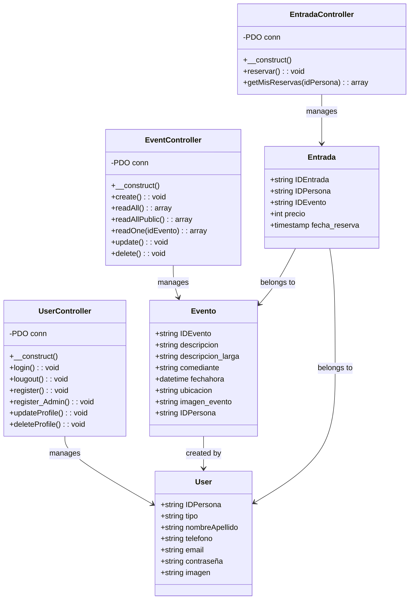
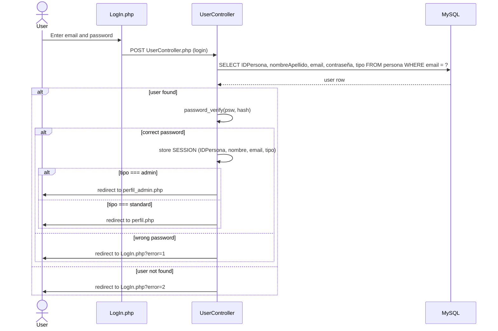
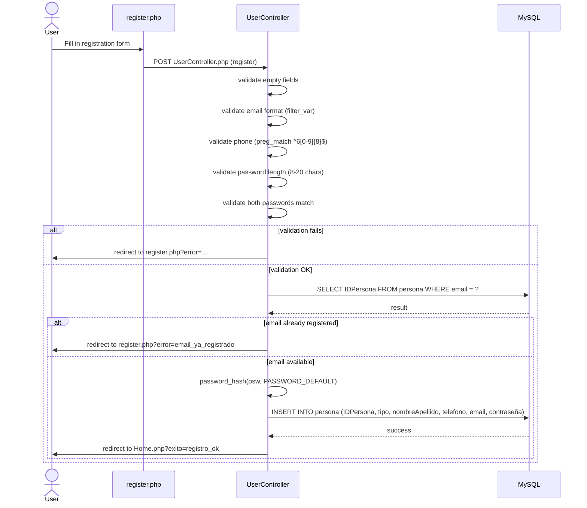
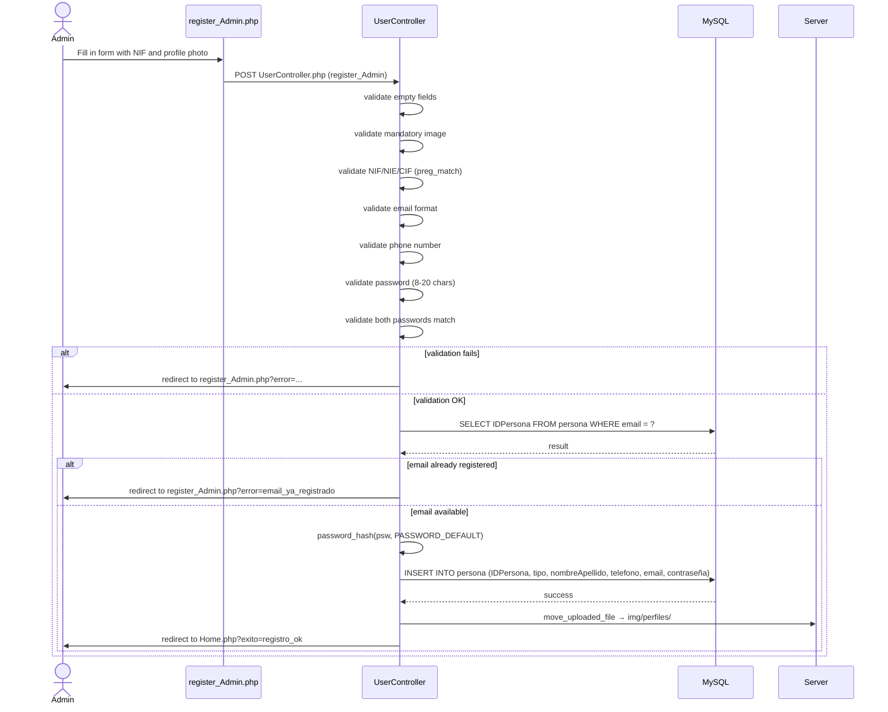

# Stand App

## Overview

Stand App is a PHP web application for discovering, booking, and managing stand-up comedy shows. It connects standard users with organizers (admins) who publish events, allowing users to explore the lineup and book their tickets easily.

**Authors:** Isabel Sousa / Mauricio Patiño  
**Module:** MP0487 / M0615 — Entorns de desenvolupament / UX·UI  
**School:** Stucom · Group DAM1/DAW1

---

## Features

### Standard User
- Registration with email, phone and password validation
- Login and logout with PHP session
- View and update personal profile (name and password)
- Browse all available events
- View event details
- Book tickets for events
- Delete account

### Admin User (Organizer)
- Registration with NIF/NIE/CIF and mandatory profile photo
- Login and logout with PHP session
- View organizer profile
- Create events with image, description, location and date
- Edit and delete their own events
- View their events in the profile panel
- Delete account

### Home Page
- Dynamic upcoming events carousel loaded from the database
- Non-logged users see only the 3 nearest upcoming events
- Logged-in users see all events
- "Discover more" link redirects to login if no session, or to all events if logged in

---

## Project Structure

```
M0615_StandApp/
├── Controller/
│   ├── UserController.php       ← login, logout, register, register_Admin, updateProfile, deleteProfile
│   ├── EventController.php      ← create, readAll, readAllPublic, readOne, update, delete
│   └── EntradaController.php    ← reservar, getMisReservas
├── Model/
│   └── MF_StandApp.sql          ← database schema
└── View/
    ├── Home.php                 ← landing page with events carousel
    ├── LogIn.php                ← login form
    ├── register.php             ← standard user registration
    ├── register_Admin.php       ← organizer/admin registration
    ├── perfil.php               ← standard user profile
    ├── perfil_admin.php         ← organizer profile with event management
    ├── Event.php                ← event detail and booking
    ├── event_create.php         ← event creation form (admin only)
    ├── event_edit.php           ← event edit form (admin only)
    └── eventos_todos.php        ← full event listing (logged-in users only)
```

---

## Database

The `standapp` database contains the following tables:

| Table | Description |
|---|---|
| `persona` | System users (admin and standard) |
| `evento` | Events created by admins |
| `entrada` | Bookings made by standard users |
| `perfil` | Profile associated with each person |
| `valorar` | Event ratings |

---

## How It Works

### Class Diagram



---

### Login Sequence Diagram



---

### Register Sequence Diagram — Standard User



---

### Register Sequence Diagram — Admin



---

## Technical Requirements

- PHP 8.0 or higher
- MySQL 5.7 or higher
- XAMPP (Apache + MySQL)
- PDO extension enabled

## Installation

1. Clone the repository into `htdocs/`:
```
git clone https://github.com/IsabelVSousa/M0615_StandApp.git
```

2. Import the schema in phpMyAdmin:
   - Open `http://localhost/phpmyadmin`
   - Create the `standapp` database
   - Import the file `Model/MF_StandApp.sql`

3. Access the application:
```
http://localhost/M0615_StandApp/View/Home.php
```
